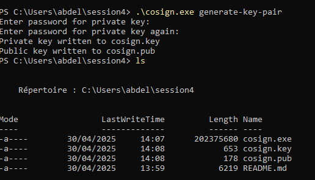
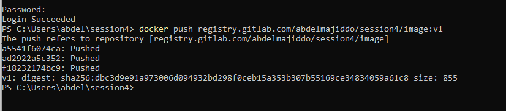
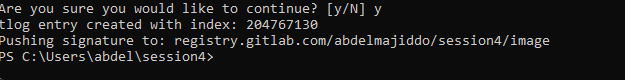
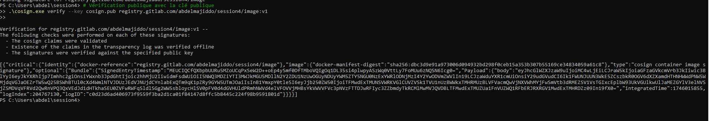
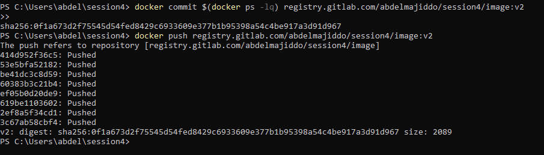
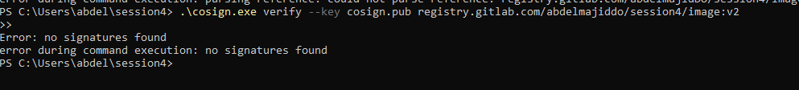
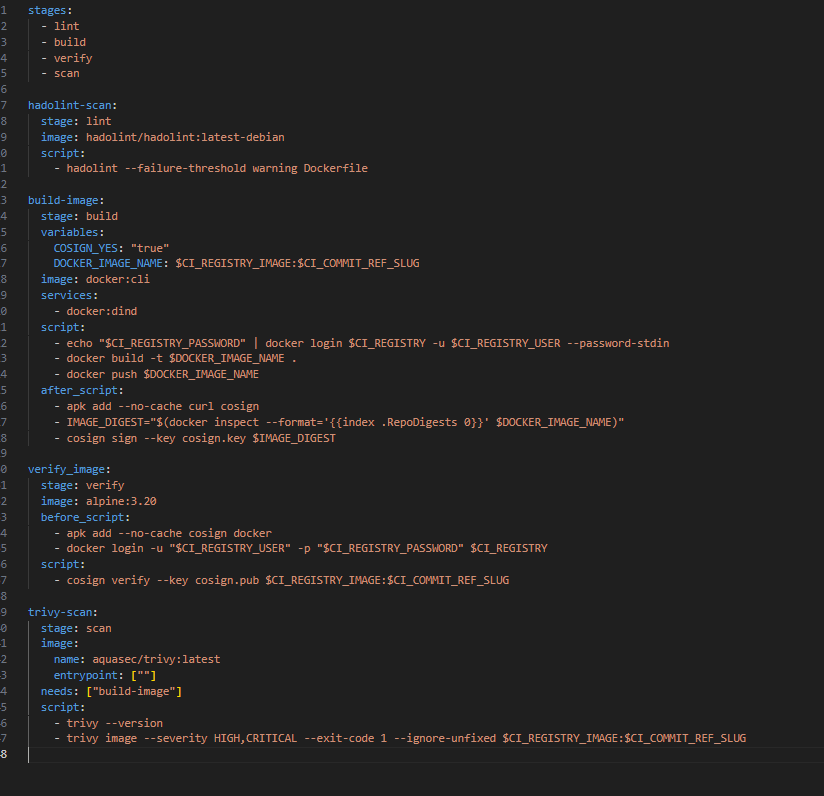

# Session 4 – Sécurité dans la CI/CD

## 1. Signature d’images avec Cosign

**Objectif**  
Comprendre l’importance de l’intégrité des images conteneurisées.

### Qu’est-ce que Cosign ?  
- **Signature numérique** : signer les images Docker/OCI avec une clé cryptographique, garantissant l’authenticité et l’origine.  
- **Intégrité des artefacts** : vérifier qu’une image n’a pas été modifiée après publication.  
- **Sécurité de la supply-chain** : valider dépendances et fournisseurs dès la phase de build.  
- **Transparence & audit** : les signatures sont remontées dans Rekor (registre public).  
- **Adoption simple** : compatible Docker, Kubernetes, OCI.

> **En résumé** : Cosign réduit les risques de **supply-chain attacks** et renforce la confiance en production.

### Bonnes pratiques  
1. **Ne jamais** stocker la clé privée dans le dépôt ; utiliser des Variables protégées ou un gestionnaire de secrets.  
2. **Tags immuables** (`sha256:…`) pour éviter les attaques de replay.  
3. Auditer les signatures avec `cosign triangletree` ou `cosign log`.

---

## 2. Activités pratiques Cosign

### 2.1. Génération de la paire de clés

```bash
curl -sSfL \
  https://github.com/sigstore/cosign/releases/latest/download/cosign-linux-amd64 \
  -o cosign && chmod +x cosign

./cosign generate-key-pair   # choisir une passphrase
```



### 2.2. Build, push & signature de l’image v1

```bash
docker build -t registry.gitlab.com/abdelmajidDO/session4/image:v1 .
docker login registry.gitlab.com
docker push registry.gitlab.com/abdelmajidDO/session4/image:v1

./cosign sign --key cosign.key \
  registry.gitlab.com/abdelmajidDO/session4/image:v1
```

  


### 2.3. Vérification avant/après altération

#### Image originale v1

```bash
./cosign verify --key cosign.pub \
  registry.gitlab.com/abdelmajidDO/session4/image:v1
```

> **Résultat** : *Verification Succeeded*  


#### Image altérée v2

```bash
docker run -it --rm registry.gitlab.com/abdelmajidDO/session4/image:v1 \
  touch /tampered
docker commit $(docker ps -lq) \
  registry.gitlab.com/abdelmajidDO/session4/image:v2
docker push registry.gitlab.com/abdelmajidDO/session4/image:v2

./cosign verify --key cosign.pub \
  registry.gitlab.com/abdelmajidDO/session4/image:v2
```

> **Résultat** : *no signatures found*  


---

## 3. Sécurité dans les pipelines CI/CD

**Objectifs**  
- Comprendre les enjeux de sécurité en CI/CD  
- Adopter les bonnes pratiques (gestion des secrets, runners isolés, signatures, scans)

**Problématiques**  
- Fuites de secrets → Vault, GitLab Variables Protected  
- Code non vérifié → runners sécurisés, signature de commits  
- Images non scannées → Trivy, Grype

---

## 4. Mise en œuvre GitLab CI

### 4.1. Dockerfile

```dockerfile
FROM alpine:3.21.3
RUN apk add --no-cache curl=8.12.1-r1
```

### 4.2. Pipeline (`.gitlab-ci.yml`)

```yaml
stages:
  - lint
  - build
  - verify
  - scan

hadolint-scan:
  stage: lint
  image: hadolint/hadolint:latest-debian
  script:
    - hadolint --failure-threshold warning Dockerfile

build-image:
  stage: build
  image: docker:cli
  services:
    - docker:dind
  variables:
    COSIGN_YES: "true"
    DOCKER_IMAGE_NAME: $CI_REGISTRY_IMAGE:$CI_COMMIT_REF_SLUG
  script:
    - echo "$CI_REGISTRY_PASSWORD" | docker login $CI_REGISTRY \
        -u $CI_REGISTRY_USER --password-stdin
    - docker build -t $DOCKER_IMAGE_NAME .
    - docker push $DOCKER_IMAGE_NAME
  after_script:
    - apk add --no-cache curl cosign
    - cosign sign --key cosign.key $DOCKER_IMAGE_NAME

verify_image:
  stage: verify
  image: docker.io/sigstore/cosign:v2.5.0
  script:
    - cosign verify --key cosign.pub $CI_REGISTRY_IMAGE:$CI_COMMIT_REF_SLUG

trivy-scan:
  stage: scan
  image:
    name: aquasec/trivy:latest
    entrypoint: [""]
  needs: ["build-image"]
  before_script:
    - echo "$CI_REGISTRY_PASSWORD" | docker login $CI_REGISTRY \
        -u $CI_REGISTRY_USER --password-stdin
  script:
    - trivy --version
    - trivy image --username "$CI_REGISTRY_USER" \
        --password "$CI_REGISTRY_PASSWORD" \
        --severity HIGH,CRITICAL --exit-code 1 --ignore-unfixed \
        "$CI_REGISTRY_IMAGE:$CI_COMMIT_REF_SLUG"
```

### 4.3. Résultats du pipeline

- **hadolint-scan** → réussit ✅  
- **build-image** → réussit ✅  
- **verify_image** (Cosign v2.5.0) → erreur  
    
- **trivy-scan** → réussit ✅
  

---

## 5. Simulation de vulnérabilité

Modifiez le Dockerfile :

```diff
-FROM alpine:3.21.3
+FROM alpine:3.12
 RUN apk add --no-cache curl=7.79.1-r1
```

Puis `git commit && git push`.  
Le pipeline **échoue** au job **trivy-scan** :  
Trivy détecte des vulnérabilités HIGH/CRITICAL (exit code 1).

---

> **Conclusion** :  
> Workflow CI/CD sécurisé mis en place :  
> 1. Lint Dockerfile  
> 2. Build & signature Cosign  
> 3. Vérification d’intégrité  
> 4. Scan vulnérabilités  
